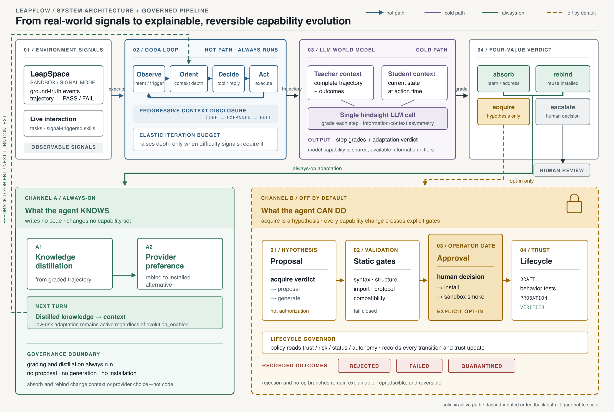

# World-Model-Driven Harness Self-Evolution Through a Plugin System

> **Status:** Architecture and implementation reference. This document describes the current LeapFlow design and its intended operational boundaries; it is not a claim that every experimental integration is production-complete.

## Abstract

LeapFlow treats environmental change as evidence about a capability gap, rather than as authorization to rewrite the agent runtime. Its self-evolution architecture therefore separates three concerns: (i) a world model that retrospectively interprets execution evidence and distils environmental knowledge, (ii) a plugin system that makes capabilities discoverable, governable, and reversible, and (iii) a stable Harness that supplies the cross-cutting contracts under which capabilities may operate. LeapSpace supplies controlled application environments and observable signals; LeapBoard renders the resulting causal process for human inspection.

The central claim is deliberately narrow. Most adaptation should occur without writing code: the agent can absorb a change through updated knowledge, rebind a requirement to an installed capability, or escalate a decision to a human. Code generation is reserved for an unmet, task-relevant capability requirement and is introduced as a governed plugin rather than as an arbitrary modification of Harness source code. This division preserves extensibility while retaining lifecycle control, risk gating, auditability, and rollback.

## 1. Motivation and Scope

An agent operating in an open and changing environment faces a recurrent problem: an observed failure may indicate an execution error, an obsolete environmental assumption, a missing integration, a policy boundary, or an unavailable credential. Treating every failure as a request to modify framework code is unsafe and analytically unsound. Conversely, treating all change as a prompt-only problem leaves the agent unable to acquire genuinely absent operational capabilities.

LeapFlow addresses this problem by making adaptation an evidence-driven, layered process. The system is concerned with **capability evolution**, not unrestricted self-modification. A model-generated recommendation is a hypothesis; it must be checked against typed evidence, the active capability catalog, governance policy, approval requirements, sandbox constraints, and observed outcomes before it can change the deployed capability set.

This document focuses on the relation among four elements:

1. **World model:** retrospective assessment and knowledge distillation.
2. **Plugin system:** managed acquisition, selection, execution, and retirement of capabilities.
3. **Harness:** stable runtime contracts for safety, isolation, lifecycle, and observability.
4. **LeapSpace and LeapBoard:** respectively, the experimental/environmental surface and the human-observable presentation surface.

The term *Harness self-evolution* is used in this restricted sense: the Harness can improve its effective composition and learned operating policy through governed capability evolution. It does **not** mean that an LLM receives unrestricted authority to edit the core runtime online.

## 2. Architectural Thesis

The architecture follows the principle that a capability should be composed rather than built into the core runtime. Tools, platform adapters, signal sources, and other extensions are specified through runtime-checkable protocols and managed by common discovery and lifecycle machinery. The Harness owns the rules of composition; plugins own concrete capability implementations.

*Figure 1. From real-world signals to explainable, reversible capability evolution. The figure depicts LeapSpace as an evidence-producing environment and focuses on the LeapFlow execution and evolution paths. LeapBoard, the read-only presentation surface, is introduced in [Section 8](#8-leapspaceleapflowleapboard-causal-plane).*

### 2.1 Reading the Architecture

Figure 1 is read from left to right and then from the hot path into the cold path:

1. **Signals enter the acting loop.** LeapSpace and live interaction provide observable environmental and execution evidence to the OODA-oriented hot path.
2. **The teacher interprets completed evidence.** The world model operates on a retrospective trajectory and returns action grades plus a four-valued adaptation verdict; it does not directly install code.
3. **The default response changes knowledge, not capability.** `absorb` and `rebind` flow through the always-on channel, distilling environmental knowledge and provider preferences into the next-turn context.
4. **Only an unmet `acquire` verdict reaches the mutation boundary.** This opt-in channel crosses proposal, validation, approval, sandbox, and trust gates before a capability can become active.
5. **Every consequential outcome becomes evidence.** Trust transitions, rejection, failure, quarantine, and rollback are retained as causal records that inform subsequent analysis and operator inspection.

The storyline therefore progresses from **observation**, to **interpretation**, to the **least invasive valid response**, and only then—when existing knowledge and installed capability are insufficient—to governed acquisition. This ordering is the central safety and efficiency claim of the architecture.

This organization makes two distinctions explicit.

First, **learning is not mutation**. A world model may improve future selection by recording what the environment now affords, or by preferring one already installed capability over another. Neither operation changes the capability set.

Second, **capability acquisition is not core rewriting**. A missing integration is normally supplied as a plugin that conforms to the Harness contracts. If a capability cannot be expressed through an existing protocol, the architectural response is to design a general protocol extension, not to inject a vendor-specific special case into the core.

## 3. System Roles

### 3.1 The Harness: Stable Constraints, Not a Mutable Script

The Harness provides the common runtime substrate: protocol boundaries, session isolation, tool dispatch, context governance, side-effect gating, recovery semantics, approval integration, persistent evidence, and plugin lifecycle control. These responsibilities are cross-cutting: an inconsistent implementation in one integration can otherwise affect unrelated tools, sessions, or clients.

A stable Harness creates a common operational language. A capability can declare its metadata, dependencies, risk, expected environment affordances, and lifecycle effects in a form that the runtime can reason about uniformly. This supports general mechanisms such as dependency injection, explicit cleanup, per-turn handler snapshots during reload, capability conflict recording, and policy-controlled mutation.

Thus, the primary benefit of Harness-level evolution is not frequent code generation inside the core. It is the incremental strengthening of reusable **contracts** when repeated evidence reveals a true abstraction gap—for example, a missing general recovery semantic or a capability descriptor that no current plugin can express. Such changes are release-level architectural work and should remain subject to normal engineering review and regression verification.

### 3.2 Tools and Skills: Behavior and Reusable Procedures

A tool is a concrete operation exposed to the agent. A skill is a reusable, parameterized procedure that organizes one or more operations around triggers, conditions, and execution knowledge. They are the appropriate adaptation surface when the agent already has the required operational primitives.

Typical examples include:

- changing tool arguments or semantic locators after a benign interface change;
- combining existing tools into a revised workflow;
- applying a learned fallback, validation step, or task decomposition;
- preferring a currently installed capability that is better suited to an observed environment.

Tools and skills alone are insufficient when the environment requires a new long-lived event source, an uninstalled platform adapter, new dependency binding, process isolation, versioning, managed cleanup, or a new externally visible side-effect boundary. These are lifecycle and governance problems, not merely procedural ones.

### 3.3 Plugins: Governed Capability Units

Plugins package concrete capabilities behind the Harness extension contract. The plugin layer supplies the mechanism needed to make a generated or newly acquired capability safe to operate over time:

- capability declaration and deterministic resolution;
- dependency binding and graceful refusal when dependencies are unavailable;
- fiber-based lifecycle transitions and effect-scope cleanup;
- conflict arbitration in the global tool namespace;
- controlled reload, disablement, retirement, and rollback;
- sandboxing and bounded invocation for untrusted code;
- approval, audit, usage evidence, progressive trust, and quarantine.

In this sense, a tool may be the *behavior* of a capability, while a plugin is the *managed unit through which that behavior enters and exits the running system*. The distinction prevents each individual tool or skill from reimplementing its own incomplete safety and lifecycle framework.

### 3.4 LeapSpace: Environment and Experiment Surface

LeapSpace provides a separated application-environment surface for observing and exercising environment-sensitive behavior. Its application harness can start sandboxed applications, coordinate reference actions and hooks, and collect `LeapSignal` records. The `LeapSpaceEnvironmentSource` adapter reads environment state and converts it into observations that LeapFlow can process.

LeapSpace therefore has two roles:

1. **Evidence production:** it exposes structured environmental state and task outcomes instead of requiring the world model to infer change from opaque failure text alone.
2. **Experiment control:** it permits controlled investigation of adaptation hypotheses without treating the experiment controller as an authority to mutate production capability state.

The separation is important. An environmental delta is an observation, not a command. It becomes relevant to evolution only if it is typed, task-relevant, supported by admissible evidence, and unresolved by the live capability catalog.

### 3.5 LeapBoard: Human-Observable Causal Presentation

LeapBoard is the presentation and inspection surface for runtime and evolution state. Its server-driven UI compiles templates into a fixed view model and distributes updates to clients through the dashboard server and watch mechanisms. This makes the evolution process inspectable without giving the dashboard authority over evolution decisions.

For self-evolution, LeapBoard is significant because it can render the causal chain that would otherwise be hidden behind asynchronous workers and persistent events: observations, requirements, resolution outcomes, proposals, validation, approval, lifecycle state, trust changes, and terminal outcomes. The appropriate role of LeapBoard is **explainability and operational oversight**, not autonomous governance.

## 4. World-Model Adaptation Loop

### 4.1 Teacher–Student Separation

LeapFlow separates retrospective evaluation from online task execution. The acting agent executes the current task using the smallest sufficient context and available capabilities. At a session boundary, a durable teacher worker processes recorded evidence and invokes the trajectory grader. The teacher produces action grades and adaptation verdicts; derived knowledge is stored as evidence-backed state for later use by the student.

This separation has practical benefits:

- normal turns are not blocked by expensive retrospective reasoning;
- teacher output can be checked, persisted, expired, and audited independently;
- the online agent receives concise, task-relevant knowledge rather than an unbounded trajectory history;
- model advice remains evidence rather than executable authority.

### 4.2 The Four-Valued Adaptation Verdict

The adaptation action space is deliberately closed:

| Verdict | Interpretation | Capability-set consequence |
|---|---|---|
| `absorb` | Existing retry, semantic-addressing, or execution mechanisms already cover the change. | No change. |
| `rebind` | Another installed plugin or tool already satisfies the requirement in the observed environment. | No new code; selection preference may change. |
| `acquire` | No available capability satisfies the typed, task-relevant requirement. | Candidate code may be proposed, subject to governance. |
| `escalate` | A human decision, credential, scope, or policy action is required. | No autonomous mutation. |

The ordering is intentional: `absorb` and `rebind` are cheaper and safer than `acquire`. Every verdict includes knowledge that informs future execution. Only `acquire` may lead to code generation, and even then it remains a recommendation rather than authorization.

This design counters a common failure mode in agentic systems: interpreting a changed environment as proof that the incumbent implementation is defective. An incumbent can be correct for a previous application version while an alternate adapter is now more appropriate. The verdict asks what action is supported by evidence, not which component is to blame.

### 4.3 Event-Sourced Knowledge, Resolution, and Selection

Evolution evidence is persisted through an append-only event store. Read models, including distilled knowledge and rebind preferences, are projections over that evidence rather than independent sources of truth. A preference extracted from a `rebind` verdict can influence selection, but it is intentionally weaker than structural constraints such as declared capability fit and environment affordances.

Before generating new code, LeapFlow resolves a typed requirement against the live catalog. A satisfiable requirement becomes an explicit no-op or rebind result rather than a duplicate proposal. This **resolution-before-acquisition** rule operationalizes the least-invasive-response principle shown in Figure 1.

The capability resolver scores live candidates using declared matching, environmental compatibility, risk cost, trust, reliability, and—when present—distilled preference. A teacher recommendation cannot make an incompatible candidate eligible; it is evidence that informs a deterministic resolution process, not a hidden control channel.

The user-visible `evolution.enabled` setting, disabled by default, governs the only branch that may introduce a new capability: whether an `acquire` verdict may enter the proposal path. It does not disable world-model grading, knowledge distillation, or read-only selection guidance. The system can therefore learn from an environment while capability mutation remains disabled.

## 5. Governed Plugin Acquisition

### 5.1 Gate Sequence

Only an eligible, unresolved `acquire` requirement traverses the following sequence:

| Stage | Required result before the next stage |
|---|---|
| Evidence and resolution | A typed, task-relevant requirement remains unsatisfied by the live catalog. |
| Proposal and generation | A candidate artifact is associated with its causal evidence and declared capability. |
| Validation and compatibility | Syntax, structure, import/protocol conformance, and compatibility assessment succeed. |
| Approval and sandboxing | The operator gate permits the mutation and the artifact passes bounded sandbox smoke checks. |
| Registration and probation | The plugin enters at `DRAFT`, then accumulates behavior-test and outcome evidence. |
| Trust or containment | Observed outcomes support advancement, demotion, quarantine, disablement, or rollback. |

The sequence is intentionally more restrictive than “LLM writes a file and imports it.” It preserves the answer to four accountability questions:

1. **Why was this capability needed?** The requirement is linked to source evidence and resolution results.
2. **Why is this implementation admissible?** Validation, compatibility assessment, and approval precede activation.
3. **What happens if it fails?** Outcomes drive demotion, quarantine, disablement, or rollback.
4. **Can the decision be reconstructed?** Causal records include no-op, rejected, and failed branches, not only successful installation.

### 5.2 Progressive Trust and Reversibility

New plugins start with limited trust. Trust can advance through observed success and can be reduced by consecutive failures; an internal defect can permanently freeze a capability. Plugins can also be isolated in a subprocess, invoked over bounded JSON-RPC, and removed from service through lifecycle governance.

This mechanism makes adaptation reversible. It also makes the system more conservative precisely where a model-generated artifact is most uncertain: before the capability has accumulated operational evidence.

## 6. Why a Plugin System Is Necessary

It is reasonable to ask whether tools and skills alone could perform self-evolution. For many changes, they can and should. The plugin system is necessary only because some adaptations have properties that cannot be safely represented as a local procedure.

| Requirement | Tool/skill-only approach | Plugin-governed approach |
|---|---|---|
| Revised procedure using existing operations | Sufficient. | Optional wrapper only. |
| New vendor adapter or native API integration | Ad hoc import and registration risk. | Declared capability, dependency binding, validation, and lifecycle. |
| Long-lived stream, subscription, or polling source | Cleanup and reload ownership are easy to leak. | Fiber and effect scope define ownership and disposal. |
| Untrusted generated code | In-process execution expands blast radius. | Sandbox, timeout, and restricted dependency surface. |
| Capability conflict or version replacement | Local code may silently shadow an incumbent. | First-wins arbitration, conflict record, and managed rollback. |
| Mutation with external side effects | Each implementation may invent inconsistent policy. | Shared risk, approval, audit, and recovery contracts. |
| Multi-session daemon runtime | Local changes can cause nondeterministic shared-state behavior. | Per-turn snapshots and process-global lifecycle discipline. |

The plugin system is thus not an alternative to tools and skills. It is the governance and operational substrate that allows certain tools, skills, adapters, and signal sources to exist safely as dynamically managed capabilities.

## 7. When Harness-Level Evolution Is Justified

Harness-level changes should be exceptional. They are justified when evidence reveals a general deficiency in the extension contract or in a cross-cutting invariant that cannot be solved by a conforming plugin. Examples include a missing neutral protocol for a class of external effects, a session-isolation flaw, or a generic recovery semantic absent from the runtime.

The expected benefits are system-wide:

- one corrected contract can improve every current and future plugin;
- common safety invariants become enforceable at a single boundary;
- duplicated vendor-specific work can be replaced by a reusable abstraction;
- observability and rollback remain coherent across all capabilities.

The expected costs are likewise system-wide: core defects can affect all sessions and all plugins. For this reason, Harness changes require conventional engineering controls—design review, compatibility analysis, targeted and broad regression testing, and deliberate release management. They are not an online action selected directly by a world-model verdict.

A practical decision rule follows:

> Prefer knowledge adaptation, then rebind, then a governed plugin. Consider a Harness change only when multiple independently evidenced needs expose a stable, general contract gap.

## 8. LeapSpace–LeapFlow–LeapBoard Causal Plane

Figure 1 details the LeapSpace-to-LeapFlow execution and evolution pipeline. LeapBoard is deliberately not a control node in that figure; it completes the architecture as the human-observable presentation surface. The three systems therefore form complementary surfaces rather than a monolithic control loop.

| Surface | Primary responsibility | Causal output |
|---|---|---|
| **LeapSpace** | Controlled application environments, `LeapSignal` records, and task outcomes | Typed environmental and task-outcome observations |
| **LeapFlow** | Filtering, world-model reasoning, capability resolution, and lifecycle governance | Read-only evolution, lifecycle, and provenance events |
| **LeapBoard** | Causal views, watch updates, evolution lens, and operator inspection | Human-observable operational state |

**Causal path:** **LeapSpace** → *typed observations* → **LeapFlow** → *causal events* → **LeapBoard**.

This decomposition preserves a separation of powers: LeapSpace produces and stages evidence; LeapFlow reasons over admissible evidence and governs capability change; LeapBoard exposes causal state without bypassing policy or approval. LeapSpace does not register production capabilities, LeapBoard does not approve or execute mutations, and the world model does not install code directly.

## 9. Safety and Scientific Integrity Properties

The architecture is intended to support the following properties.

### 9.1 Evidence-Bounded Mutation

An environmental observation or model suggestion is insufficient by itself. Mutation requires a typed, task-relevant, unresolved capability requirement and subsequent governance gates.

### 9.2 Resolution Completeness

A requirement already satisfied by the live catalog should produce a recorded no-op or rebind, rather than a new capability artifact. This property controls unnecessary growth and makes non-mutation a visible outcome.

### 9.3 Causal Traceability

The causal record should connect environmental evidence, requirement formation, catalog resolution, policy and approval decisions, artifact identity, validation, lifecycle and trust outcomes, and any retirement or rollback. Rejections and no-ops are first-class observations, not missing data.

### 9.4 Bounded Autonomy

The agent may improve its knowledge and selection policy without the authority to rewrite its capability set. The capability-writing branch is opt-in and constrained by validation, approval, sandboxing, and post-deployment trust evidence.

### 9.5 Cold-Path Governance

Retrospective grading, proposal processing, telemetry, and broad co-evolution sweeps are designed as cold-path work and should not execute synchronously inside the ordinary turn-critical loop. This reduces direct coupling to response latency; it does not prove that background workers consume no daemon scheduling or compute resources. Operational evaluation must therefore measure their effect on ordinary execution as well as their adaptation benefit.

## 10. Limitations and Non-Claims

The current architecture should be interpreted with the following limitations.

- `evolution.enabled` is off by default; an `acquire` verdict does not imply that a new capability will be generated or installed.
- LeapSpace's `e2e` application-harness mode is explicitly incomplete; the existence of LeapSpace components should not be read as proof of a complete end-to-end production environment-adaptation path.
- Some telemetry is intentionally optional and depends on sink installation. The absence of a presentation event is not proof that no internal event occurred.
- World-model output is fallible. It is treated as evidence and recommendation, not as a source of authorization or a replacement for declared constraints.
- Plugin mutation is process-global even though session state is isolated. Any change to the active capability set must therefore be evaluated against concurrent-client behavior.
- This document does not claim autonomous architectural redesign of the Harness. Stable core-contract evolution remains an engineering activity, not an automatic side effect of a single trajectory.

## 11. Evaluation Implications

A rigorous evaluation should distinguish adaptation quality from mere code-generation frequency. At minimum, experiments should report:

- the number and provenance of environmental deltas;
- outcomes by verdict class: `absorb`, `rebind`, `acquire`, and `escalate`;
- resolution no-ops versus true unmet requirements;
- proposal acceptance, rejection, expiration, installation, rollback, and quarantine outcomes;
- reliability, latency, and safety effects before and after adaptation;
- evidence coverage and the presence of complete causal records;
- counterfactual baselines, including unchanged environments and irrelevant deltas correctly rejected.

An evaluation that measures only successful installations risks rewarding unnecessary mutation. A mature system should often demonstrate adaptation through knowledge, re-selection, or deliberate non-action.

## 12. Conclusion

World-model-driven self-evolution is most useful when it is framed as **governed capability adaptation** rather than autonomous core rewriting. The world model identifies and distils what changed; the capability resolver determines whether the live system already has a valid response; the plugin system admits, tests, governs, and—when necessary—retires new operational capability; the Harness maintains the common safety and lifecycle invariants; LeapSpace provides controlled environmental evidence; and LeapBoard makes the chain observable to human operators.

The resulting system favors the least invasive valid response. It learns first, reuses second, acquires cautiously, and escalates when authority or evidence is insufficient. This is the essential rationale for a plugin-based self-evolution architecture: it makes adaptation extensible without converting every environmental change into an unbounded modification of the agent runtime.

## Appendix A. Primary Implementation Map

| Concern | Primary implementation references |
|---|---|
| Adaptation action model | [`src/leapflow/domain/adaptation_verdict.py`](../src/leapflow/domain/adaptation_verdict.py) |
| Teacher grading and verdict generation | [`src/leapflow/world_model/trajectory_grader.py`](../src/leapflow/world_model/trajectory_grader.py) |
| Durable retrospective worker | [`src/leapflow/evolution/teacher_worker.py`](../src/leapflow/evolution/teacher_worker.py) |
| Co-evolution cold path | [`src/leapflow/evolution/sweep.py`](../src/leapflow/evolution/sweep.py) |
| Event-backed distilled knowledge | [`src/leapflow/storage/distilled_knowledge_store.py`](../src/leapflow/storage/distilled_knowledge_store.py) |
| Capability resolution | [`src/leapflow/plugins/capability_resolver.py`](../src/leapflow/plugins/capability_resolver.py) |
| Plugin lifecycle governance | [`src/leapflow/plugins/lifecycle_governor.py`](../src/leapflow/plugins/lifecycle_governor.py) |
| Plugin contracts and metadata | [`src/leapflow/plugins/protocol.py`](../src/leapflow/plugins/protocol.py) |
| Plugin lifecycle specification | [`docs/plugins/plugin_lifecycle_management.md`](plugins/plugin_lifecycle_management.md) |
| LeapSpace application harness | [`src/leapspace/app_space/harness.py`](../src/leapspace/app_space/harness.py) |
| LeapSpace signals | [`src/leapspace/app_space/signal.py`](../src/leapspace/app_space/signal.py) |
| LeapSpace-to-LeapFlow adapter | [`src/leapflow/perception/leapspace_source.py`](../src/leapflow/perception/leapspace_source.py) |
| LeapBoard server | [`src/leapflow/dashboard/server.py`](../src/leapflow/dashboard/server.py) |
| LeapBoard templates | [`src/leapflow/dashboard/templates.py`](../src/leapflow/dashboard/templates.py) |
| Configuration and evolution gate | [`src/leapflow/config.py`](../src/leapflow/config.py) |
| Engineering constraints | [`AGENTS.md`](../AGENTS.md) |
| Architecture figure asset | [`assets/harness_evolution_architecture.png`](../assets/harness_evolution_architecture.png) |
